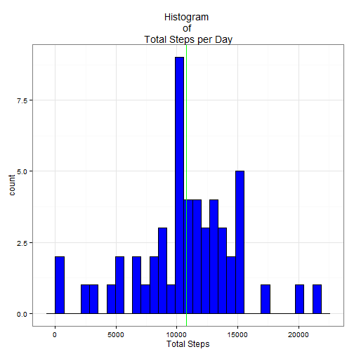
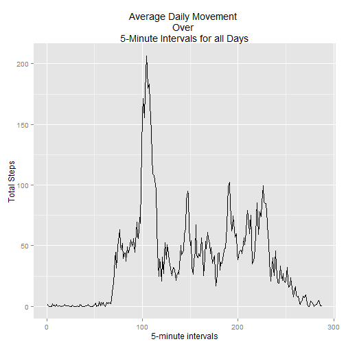
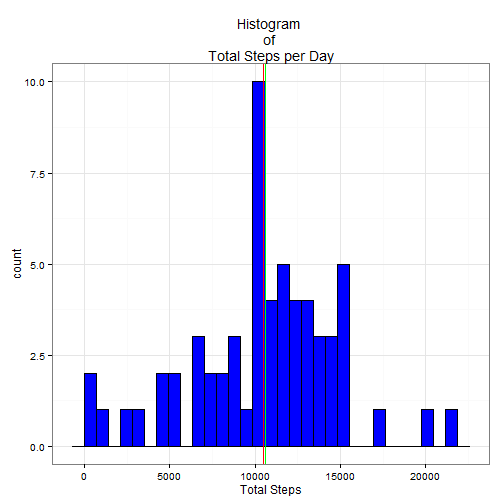
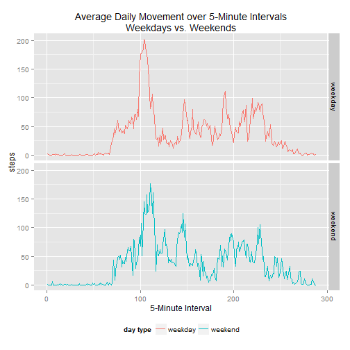

This document is being completed to meet the requirements for the Coursera Reproducible Research Project 1.  

The code will:

* Read in a file 

* Write a report that answers the questions detailed below.  

* Create a Markdown document in HTML file format. 


This program will use the **activity monitor** data set.  The data set will be stored in the data folder.

## Loading and preprocessing the data

I am using the tempfile() function.  This function will create a temporary file in the directory defined by tempdir() function.  This temporary file will be removed once RStudio closes.


```r
temp <- tempfile()
fileUrl <- "https://d396qusza40orc.cloudfront.net/repdata%2Fdata%2Factivity.zip"

download.file(url=fileUrl, destfile = temp)
import <- read.csv(unz(temp, "activity.csv"), stringsAsFactors = FALSE)
unlink(temp)
head(import)
```

```
##   steps       date interval
## 1    NA 2012-10-01        0
## 2    NA 2012-10-01        5
## 3    NA 2012-10-01       10
## 4    NA 2012-10-01       15
## 5    NA 2012-10-01       20
## 6    NA 2012-10-01       25
```

```r
##MyRowCount <- nrow(import)
```

There are 17568 observations in my dataset.

There are 3 columns in my dataset:

+ **steps:** Number of steps taking in a 5-minute interval (missing values are coded as NA)
+ **date:** The date on which the measurement was taken in YYYY-MM-DD format
+ **interval:** Identifier for the 5-minute interval in which measurement was taken

Look at the structure of the dataset as well as a sample of the data we are using:


```r
str(import)
```

```
## 'data.frame':	17568 obs. of  3 variables:
##  $ steps   : int  NA NA NA NA NA NA NA NA NA NA ...
##  $ date    : chr  "2012-10-01" "2012-10-01" "2012-10-01" "2012-10-01" ...
##  $ interval: int  0 5 10 15 20 25 30 35 40 45 ...
```

```r
head(import)
```

```
##   steps       date interval
## 1    NA 2012-10-01        0
## 2    NA 2012-10-01        5
## 3    NA 2012-10-01       10
## 4    NA 2012-10-01       15
## 5    NA 2012-10-01       20
## 6    NA 2012-10-01       25
```

I want to use a true DATE data type instead of a factor variable.  To do this I will use **lubridate**.  While we are doing the conversion of dates I will also convert the other data types to be a bit more flexable for my processing.


```r
library(lubridate)
import$steps <- as.numeric(import$steps)
import$date <- ymd(import$date)
import$interval <- factor(import$interval, levels=unique(import$interval), labels=unique(import$interval), ordered=TRUE)

str(import)
```

```
## 'data.frame':	17568 obs. of  3 variables:
##  $ steps   : num  NA NA NA NA NA NA NA NA NA NA ...
##  $ date    : POSIXct, format: "2012-10-01" "2012-10-01" ...
##  $ interval: Ord.factor w/ 288 levels "0"<"5"<"10"<"15"<..: 1 2 3 4 5 6 7 8 9 10 ...
```

Because I want the flexibility to summarize my data in any way my future research may require I am going to "melt" my data into a dataset called MeltData.


```r
library(reshape2)
MeltData <- melt(import, id.vars = c("date", "interval"), measure.vars = c("steps"))

str(MeltData)
```

```
## 'data.frame':	17568 obs. of  4 variables:
##  $ date    : POSIXct, format: "2012-10-01" "2012-10-01" ...
##  $ interval: Ord.factor w/ 288 levels "0"<"5"<"10"<"15"<..: 1 2 3 4 5 6 7 8 9 10 ...
##  $ variable: Factor w/ 1 level "steps": 1 1 1 1 1 1 1 1 1 1 ...
##  $ value   : num  NA NA NA NA NA NA NA NA NA NA ...
```

##What is mean total number of steps taken per day?

```r
tot.step.perday <- dcast(MeltData, date ~ variable, fun.aggregate = sum)

head(tot.step.perday)
```

```
##         date steps
## 1 2012-10-01    NA
## 2 2012-10-02   126
## 3 2012-10-03 11352
## 4 2012-10-04 12116
## 5 2012-10-05 13294
## 6 2012-10-06 15420
```

The following plot will show the histogram of the Mean Total steps taken per day.


```r
library(ggplot2)
gplot <- ggplot(data=tot.step.perday, aes(x=steps))
gplot <- gplot + geom_histogram(fill="blue", color="black")
gplot <- gplot + geom_vline(xintercept=mean(tot.step.perday$steps, na.rm=TRUE), color="red")
gplot <- gplot + geom_vline(xintercept=median(tot.step.perday$steps, na.rm=TRUE),color="green")
gplot + theme_bw() + theme(legend.position="top")+labs(title="Histogram \nof \nTotal Steps per Day") + labs(x="Total Steps")
```

```
## stat_bin: binwidth defaulted to range/30. Use 'binwidth = x' to adjust this.
```

 

The plot is displaying the Mean and Median but because the mean **1.0766189 &times; 10<sup>4</sup>** and median **1.0765 &times; 10<sup>4</sup>** are so close it looks like the there is only one line.

##What is the average daily activity pattern?
Because we are needing to look at the mean per interval I will dcast the dataset looking at the mean steps


```r
mean.step.perint <- dcast(MeltData, interval ~ variable, mean, na.rm=TRUE)
head(mean.step.perint)
```

```
##   interval     steps
## 1        0 1.7169811
## 2        5 0.3396226
## 3       10 0.1320755
## 4       15 0.1509434
## 5       20 0.0754717
## 6       25 2.0943396
```

I will plot the average daily activity at the intervel.  This plot will be in 5-minute intervals, on average across all the days in the dataset.


```r
gplot <- ggplot(mean.step.perint, aes(x=as.integer(interval), y=steps)) 
gplot + geom_line() + labs(x="5-minute intervals", title="Average Daily Movement \nOver \n5-Minute Intervals for all Days") + labs(y="Total Steps")
```

 

This plot shows that on the 104 interval we had an average number os steps of 206.1698113 which were the maximum average steps per day in our sample

##Imputing missing values
This data has **2304** missing values in the **steps** column.  We will now look at the impact of these missing values on our calculations.

There is a package called **missForest**.  The description of this package is:

"'missForest' is used to impute missing values particularly in the case of mixed-type data. It can be used to impute continuous and/or categorical data including complex interactions and nonlinear relations. It yields an out-of-bag (OOB) imputation error estimate. Moreover, it can be run parallel to save computation time.""

The package description goes on to say "After each iteration the difference between the previous and the new imputed data matrix is assessed for the continuous and categorical parts."

I will use this package to fill in the missing values in my dataset.


```r
## install.packages('randomForest')
## install.packages('missForest')

library(randomForest)
```

```
## randomForest 4.6-12
## Type rfNews() to see new features/changes/bug fixes.
```

```r
library(missForest)
```

```
## Loading required package: foreach
## foreach: simple, scalable parallel programming from Revolution Analytics
## Use Revolution R for scalability, fault tolerance and more.
## http://www.revolutionanalytics.com
## Loading required package: itertools
## Loading required package: iterators
```

```r
My.impute.data <- missForest(data.matrix(MeltData), verbose=TRUE, replace=TRUE)
```

```
##   missForest iteration 1 in progress...done!
##     estimated error(s): 5.635894e-08 
##     difference(s): 3.196263e-16 
##     time: 31.48 seconds
## 
##   missForest iteration 2 in progress...done!
##     estimated error(s): 5.788231e-08 
##     difference(s): 3.436606e-18 
##     time: 31.05 seconds
## 
##   missForest iteration 3 in progress...done!
##     estimated error(s): 5.797559e-08 
##     difference(s): 4.101104e-18 
##     time: 30.79 seconds
```

The imputed values generated by missForest are stored in a data matrix as an attribute of the My.impute.data object.  You can see an example of the new vlaues by looking at the first few rows of this matrix.


```r
head(My.impute.data$xinp)
```

```
## NULL
```

As can be seen above, the missForest has reformated our data.  We will now reapply the formating we used earlier.


```r
My.impute.formated <- as.data.frame(My.impute.data$ximp)

## Reformat date
class(My.impute.formated$date) <- class(MeltData$date)
My.impute.formated$date <- format(My.impute.formated$date, '%Y-%m-%d')
My.impute.formated$date <- ymd(My.impute.formated$date)

## Reformat Interval
MyLevels <- length(levels(MeltData$interval))
My.impute.formated$interval <- factor(My.impute.formated$interval, levels=c(1:MyLevels), labels=levels(MeltData$interval), ordered = TRUE)

## Reformat variable
MyLevels <- length(levels(MeltData$variable))
My.impute.formated$variable <- factor(My.impute.formated$variable, levels=c(1:MyLevels), labels=levels(MeltData$variable))

## How does the data look now?

head(My.impute.formated)
```

```
##         date interval variable      value
## 1 2012-09-30        0    steps 4.92078217
## 2 2012-09-30        5    steps 0.08473988
## 3 2012-09-30       10    steps 0.03872798
## 4 2012-09-30       15    steps 0.03164465
## 5 2012-09-30       20    steps 0.01920020
## 6 2012-09-30       25    steps 0.37680556
```

```r
## check to see if there are any missing values now

summary(My.impute.formated)
```

```
##       date               interval      variable         value       
##  Min.   :2012-09-30   0      :   61   steps:17568   Min.   :  0.00  
##  1st Qu.:2012-10-15   5      :   61                 1st Qu.:  0.00  
##  Median :2012-10-30   10     :   61                 Median :  0.00  
##  Mean   :2012-10-30   15     :   61                 Mean   : 36.35  
##  3rd Qu.:2012-11-14   20     :   61                 3rd Qu.: 17.00  
##  Max.   :2012-11-29   25     :   61                 Max.   :806.00  
##                       (Other):17202
```

We will now dcast the data to aggrate the data by date again.  We will see the difference between the raw data and the data with the imputed data.


```r
tot.step.perday <- dcast(My.impute.formated, date ~ variable, fun.aggregate = sum)

head(tot.step.perday)
```

```
##         date      steps
## 1 2012-09-30   857.4502
## 2 2012-10-01   126.0000
## 3 2012-10-02 11352.0000
## 4 2012-10-03 12116.0000
## 5 2012-10-04 13294.0000
## 6 2012-10-05 15420.0000
```

```r
summary(tot.step.perday)
```

```
##       date                steps      
##  Min.   :2012-09-30   Min.   :   41  
##  1st Qu.:2012-10-15   1st Qu.: 8355  
##  Median :2012-10-30   Median :10600  
##  Mean   :2012-10-30   Mean   :10469  
##  3rd Qu.:2012-11-14   3rd Qu.:12883  
##  Max.   :2012-11-29   Max.   :21194
```

We will now re-crate the histogram with the imputed data


```r
gplot <- ggplot(data=tot.step.perday, aes(x=steps))
gplot <- gplot + geom_histogram(fill="blue", color="black")
gplot <- gplot + geom_vline(xintercept=mean(tot.step.perday$steps, na.rm=TRUE), color="red")
gplot <- gplot + geom_vline(xintercept=median(tot.step.perday$steps, na.rm=TRUE),color="green")
gplot + theme_bw() + theme(legend.position="top")+labs(title="Histogram \nof \nTotal Steps per Day") + labs(x="Total Steps")
```

```
## stat_bin: binwidth defaulted to range/30. Use 'binwidth = x' to adjust this.
```

 

The plot has only changed slightly.  You can now see 2 distinct lines for Mean and Median because the values are **slightly** different.  The new mean is **1.0469449 &times; 10<sup>4</sup>** and the new median is **1.06 &times; 10<sup>4</sup>**.

##Are there differences in activity patterns between weekdays and weekends?
We will now see if there is any differences in the steps per day when compairing Week days to weekends.


```r
library(plyr)
```

```
## 
## Attaching package: 'plyr'
## 
## The following object is masked from 'package:lubridate':
## 
##     here
```

```r
## Add columns to the dataframe that define if the row is a week day or a week end
My.impute.formated <- mutate(My.impute.formated, weekday=weekdays(date), day.type=ifelse(weekday %in% c("Saturday", "Sunday"), 1, 0))
My.impute.formated$day.type <- factor(My.impute.formated$day.type, levels=c(0,1), labels=c("weekday", "weekend"))
My.impute.formated$weekday<- factor(My.impute.formated$weekday, levels=c("Monday", "Tuesday", "Wednesday", "Thursday", "Friday", "Saturday", "Sunday"), ordered = TRUE)

head(My.impute.formated)
```

```
##         date interval variable      value weekday day.type
## 1 2012-09-30        0    steps 4.92078217  Sunday  weekend
## 2 2012-09-30        5    steps 0.08473988  Sunday  weekend
## 3 2012-09-30       10    steps 0.03872798  Sunday  weekend
## 4 2012-09-30       15    steps 0.03164465  Sunday  weekend
## 5 2012-09-30       20    steps 0.01920020  Sunday  weekend
## 6 2012-09-30       25    steps 0.37680556  Sunday  weekend
```

We will now **recast** the data so that we can look at the aggregat of the mean steps per 5-minute interval and teh day.type.


```r
mean.weekday.weekend <- dcast(My.impute.formated, day.type + interval ~ variable, mean)

head(mean.weekday.weekend)
```

```
##   day.type interval      steps
## 1  weekday        0 1.84227191
## 2  weekday        5 0.40911067
## 3  weekday       10 0.15911067
## 4  weekday       15 0.18183794
## 5  weekday       20 0.09100966
## 6  weekday       25 0.54547431
```

We will now look at 2 plots that will let us compare our week day to week end average steps


```r
gplot <- ggplot(mean.weekday.weekend, aes(x=as.integer(interval), y=steps)) 
gplot <- gplot + geom_line(aes(color=mean.weekday.weekend$day.type))
gplot <- gplot + facet_grid(day.type ~ .) + theme(legend.position="bottom")
gplot + labs(x="5-Minute Interval", title="Average Daily Movement over 5-Minute Intervals\nWeekdays vs. Weekends", color = "day type")
```

 
